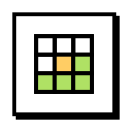
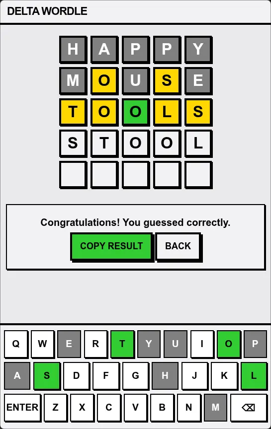

<p align="center">
  
</p>
<h1 align="center">Delta Wordle</h1>

**Delta Wordle** is a [webxdc](https://webxdc.org) app that runs inside **Delta Chat**, bringing the classic daily word game to your chats:

- 🔤 **One word per day** — Everyone in the chat plays the same 5-letter word, picked from a small curated list of common words so it stays fair
- 🎯 **5 guesses** — After each guess, tile colors guide you: 🟩 correct position, 🟨 in the word but elsewhere, ⬜ not in the word
- 👥 **Shared leaderboard** — Finished players' results sync through the chat in real time; tap a player to see their guesses
- 🏳️ **Surrender** — Give up anytime to reveal today's word (a surrender is recorded for you)
- 📋 **Copy result** — Share your grid of emoji tiles with friends
- 🌐 **Multi-language support** — All UI texts are managed through i18n files

## Screenshot



## Development

The app is plain HTML/CSS/JS with no build step. Each locale lives in its own folder under `localization/` (e.g. `localization/en/`) and is self-contained except for the shared `scripts/` and `style.css` at the project root.

To test real chat integration, you have two options:
1. Run /git-assets/make-xdc.sh and it will create /temp/app.xdc
2. Package the main folder (without `locales`) and ‍`locales/XX/` files as a `.zip` file, rename it to `.xdc` and and send it into any supported messenger(like DeltaChat).

### Custom font per language

Each locale can ship its own font via an optional `font.js` in the locale folder. Set `window.LOCALE_FONT` to one of:

- **A bundled font file** in the locale folder — `font.woff2`, `font.woff`, or `font.ttf` — optionally with a custom font-family name:

  ```js
  window.LOCALE_FONT = { file: "font.woff2", family: "Arad" };
  ```

- **A system font family name** without a file:

  ```js
  window.LOCALE_FONT = "Vazirmatn";
  ```

When `font.js` is absent, the locale falls back to the default font stack (`Tahoma, "Segoe UI", sans-serif`). The packaging scripts ship `font.js` and the referenced font file inside the `.xdc` automatically.

### Adding a language

Copy an existing locale folder under `locales/` (e.g. `locales/en/`) to `localization/<lang>/`, then:

- translate the strings in `strings.js` (set `window.DIRECTION = "rtl"` for right-to-left languages),
- provide a word list in `words.js` (5-letter words, one per line, assigned to `window.WORDS_RAW`) — this list is used to *validate guesses*,
- optionally provide a smaller curated list of common words in `answers.js` (assigned to `window.ANSWERS_RAW`) — the daily word is picked from it; when absent, the daily word falls back to `words.js`,
- adapt the on-screen keyboard layout in `keyboard.js` to the language's alphabet,
- update `name` in `manifest.toml`, and drop in an `icon.png` for that locale,
- optionally add a `font.js` with a custom font for the language (see [Custom fonts per language](#custom-font-per-language)).

The shared `scripts/normalize.js` handles letter normalization (e.g. Persian/Arabic variants) and counting display characters instead of bytes, so words are compared consistently regardless of input method.
